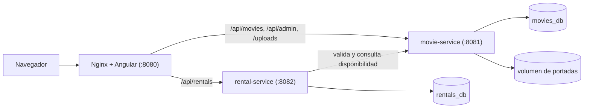

# Cartelera

Plataforma de películas con un área administrativa para gestionar el catálogo, un área pública para consultar las películas publicadas y un sistema de alquiler sin cuentas de usuario. El backend se divide en dos microservicios Spring Boot y el frontend usa Angular.

## Ejecución rápida

Necesitas Docker. Desde la raíz del repositorio:

```bash
docker compose up --build
```

La primera ejecución tarda varios minutos mientras Docker descarga las imágenes y dependencias. Al terminar, tendrás disponibles:

| Sección                     | Dirección                             |
| --------------------------- | ------------------------------------- |
| Catálogo público            | http://localhost:8080                 |
| Área administrativa         | http://localhost:8080/admin           |
| Mis alquileres              | http://localhost:8080/my-rentals      |
| API de películas (Swagger)  | http://localhost:8081/swagger-ui.html |
| API de alquileres (Swagger) | http://localhost:8082/swagger-ui.html |

Los datos de prueba se cargan automáticamente. Incluyen 19 películas, 16 publicadas y 3 en edición, junto con tres alquileres de ejemplo para el correo `demo@cartelera.test`: uno activo, uno vencido y uno devuelto.

Para reiniciar el proyecto desde cero y eliminar la base de datos y las portadas subidas:

```bash
docker compose down -v
```

## Funcionalidades

### Área administrativa

Disponible en `/admin`.

* Crear, consultar, editar y eliminar películas con nombre, portada, descripción, puntaje de 0 a 10 con un decimal y estado.
* Cambiar el estado entre Publicada y En edición desde el formulario o desde el listado.
* Registrar automáticamente las fechas de creación y modificación.
* Subir portadas en formato JPG, PNG o WEBP, con un tamaño máximo de 2 MB y vista previa.
* Buscar películas, filtrar por estado y navegar entre páginas.

### Área pública

* Muestra las películas publicadas con nombre, descripción, portada y puntaje.
* Permite buscar por nombre y ordenar por más recientes o mejor puntuadas.
* Incluye una página de detalle para cada película.

### Alquiler

* Permite alquilar una película durante 48 horas desde su página de detalle, indicando nombre y correo.
* Incluye una sección de Mis alquileres para consultar alquileres por correo, revisar alquileres activos, identificar vencidos, consultar el historial y devolver películas.

### Microservicios

* `movie-service` y `rental-service` funcionan como aplicaciones independientes.
* Cada servicio tiene su propia base de datos.
* Los servicios se comunican mediante HTTP.

## Arquitectura



* Nginx sirve el frontend y dirige cada ruta de la API al servicio correspondiente. El navegador trabaja con un único origen, por lo tanto no requiere configuración de CORS. Durante el desarrollo, `proxy.conf.json` de Angular cumple la misma función.
* `movie-service` gestiona el catálogo, las portadas y la búsqueda.
* `rental-service` gestiona los alquileres. Antes de crear un alquiler consulta a `movie-service` para verificar la existencia y publicación de la película. Al consultar los alquileres, realiza una llamada para verificar cuáles películas siguen publicadas.
* PostgreSQL usa una única instancia con una base de datos para cada microservicio, `movies_db` y `rentals_db`. Cada servicio mantiene la propiedad de sus datos y el despliegue conserva una configuración sencilla.

## Tecnologías

| Capa            | Tecnología                                                                              |
| --------------- | --------------------------------------------------------------------------------------- |
| Backend         | Java 25, Spring Boot 4.1, Spring Data JPA, Bean Validation, Flyway, springdoc-openapi   |
| Base de datos   | PostgreSQL 18                                                                           |
| Frontend        | Angular 22, componentes standalone, signals, Angular Material en el área administrativa |
| Infraestructura | Docker Compose, Nginx                                                                   |
| Pruebas         | JUnit 6, Mockito, AssertJ                                                               |

## Estructura del repositorio

```text
movie-platform/
├─ movie-service/     Catálogo, portadas y búsqueda (Spring Boot, puerto 8081)
├─ rental-service/    Alquileres (Spring Boot, puerto 8082)
├─ frontend/          Aplicación Angular y configuración de Nginx
├─ db/init.sql        Crea las dos bases de datos al iniciar PostgreSQL
└─ docker-compose.yml
```

Cada servicio sigue la estructura estándar de Spring con `controller`, `service`, `repository`, `dto`, `entity`, `exception` y `config`.

El frontend separa `core`, con API, modelos e interceptor, `shared`, con componentes reutilizables, y `features`, con las áreas pública y administrativa cargadas de forma diferida.

## API

### movie-service

| Método | Ruta                                                 | Descripción                                  |
| ------ | ---------------------------------------------------- | -------------------------------------------- |
| GET    | `/api/movies?search=&sort=recent\|score&page=&size=` | Películas publicadas                         |
| GET    | `/api/movies/{id}`                                   | Detalle de una película publicada            |
| GET    | `/api/movies/published-ids?ids=1,2`                  | Identifica cuáles películas están publicadas |
| GET    | `/api/admin/movies?search=&status=&page=&size=`      | Todas las películas                          |
| GET    | `/api/admin/movies/{id}`                             | Detalle de una película                      |
| POST   | `/api/admin/movies`                                  | Crear una película                           |
| PUT    | `/api/admin/movies/{id}`                             | Actualizar una película, incluido su estado  |
| DELETE | `/api/admin/movies/{id}`                             | Eliminar una película y su portada           |
| POST   | `/api/admin/movies/{id}/cover`                       | Subir o reemplazar una portada               |

### rental-service

| Método | Ruta                       | Descripción                                      |
| ------ | -------------------------- | ------------------------------------------------ |
| POST   | `/api/rentals`             | Alquilar una película publicada                  |
| GET    | `/api/rentals?email=`      | Consultar los alquileres asociados a un correo   |
| PATCH  | `/api/rentals/{id}/return` | Devolver un alquiler mediante el correo asociado |

Los errores siguen el formato estándar `ProblemDetail` definido por RFC 9457. Los errores de validación incluyen el detalle de cada campo dentro de `errors`.

## Decisiones de diseño

El criterio general consiste en mantener cada tecnología y patrón cuando aporta una función concreta al proyecto y al plazo de una semana. Cuando una solución sencilla cubre la necesidad, se mantiene esa solución.

* Dos microservicios. Catálogo y alquileres representan las dos áreas principales del dominio. Separar alquileres cubre los requisitos adicionales sin crear más servicios.
* Sin API Gateway, Eureka ni Config Server. Nginx ya sirve el frontend y dirige las solicitudes de la API. Docker Compose resuelve los nombres de los servicios mediante su DNS interno.
* Comunicación con `RestClient`, timeouts y manejo de errores, sin Resilience4j. El proyecto tiene pocas llamadas entre servicios. Si `movie-service` no responde, `rental-service` devuelve un 503 y la consulta de alquileres continúa aunque no logre verificar la disponibilidad.
* Portadas almacenadas en un volumen de Docker. El proyecto trabaja con una única instancia, por lo tanto no necesita una base de datos ni un servicio de objetos para almacenar imágenes. La base guarda el nombre del archivo y cada portada recibe un nombre único para facilitar la caché del navegador.
* Búsqueda mediante un método derivado de Spring Data y paginación con `Pageable`. El volumen de datos previsto no requiere índices especiales ni caché.
* Flyway gestiona el esquema y los datos de prueba mediante versiones reproducibles. Hibernate valida la correspondencia entre las entidades y el esquema.
* Validación en frontend y backend. El frontend informa los errores antes de enviar los datos y el backend realiza su propia validación.
* Estado del catálogo en la URL mediante `?q=&sort=&page=`. Un enlace compartido conserva la búsqueda y los botones de navegación del navegador mantienen su funcionamiento.
* Layouts separados para las áreas pública y administrativa. El catálogo usa una interfaz con estética de cine y el área administrativa usa Angular Material.

## Supuestos

El enunciado deja algunos puntos abiertos. El proyecto toma las siguientes decisiones.

### Catálogo

* El puntaje va de 0 a 10, con un decimal, y lo asigna el administrador.
* La búsqueda admite coincidencias parciales y distingue las tildes, pero no distingue mayúsculas.
* "Última entrada" corresponde a la fecha de creación, es decir, la fecha de entrada al catálogo. El orden predeterminado es "más recientes".
* El área administrativa no tiene autenticación porque el enunciado no la solicita.
* Si dos administradores editan una película al mismo tiempo, prevalece la última edición guardada.
* Los datos de prueba se cargan en cualquier entorno.

### Alquiler

* El sistema no usa cuentas. Identifica al cliente mediante nombre y correo. El correo permite consultar los alquileres y sirve como requisito para devolver una película.
* Cualquier persona con acceso a un correo puede consultar sus alquileres. Esta decisión responde al alcance definido en el enunciado, sin implementar un sistema de usuarios.
* La duración de cada alquiler es de 48 horas. El sistema no maneja precios ni pagos.
* El sistema permite alquilar únicamente películas publicadas y evita dos alquileres activos de la misma película para el mismo correo.
* Un alquiler vencido conserva el estado activo hasta su devolución. El sistema lo identifica como vencido durante la consulta, sin tareas programadas.
* El alquiler guarda una copia del título. Si el administrador renombra la película, el alquiler conserva el nombre registrado durante la compra.
* Si una película alquilada pasa a edición o se elimina, el alquiler conserva su acceso hasta el vencimiento y muestra la etiqueta "Ya no está en cartelera".

## Experiencia de uso

* El catálogo muestra una franja de pósters. Un póster se expande para mostrar su información y los demás permanecen plegados. El usuario navega mediante clic, toque o flechas del teclado.
* Al final de la franja aparecen tiras cada vez más delgadas para indicar la existencia de más páginas.
* En dispositivos móviles, la franja se transforma en una lista vertical y el panel de detalle queda centrado en pantalla.
* El alquiler se completa desde el detalle de la película y se confirma mediante un boleto.
* La interfaz respeta la preferencia de movimiento reducido del sistema y permite la navegación mediante teclado.

## Desarrollo local sin Docker

Requiere Java 25 y Node.js 24.

```bash
docker compose up -d postgres            # inicia únicamente la base de datos

cd movie-service && ./mvnw spring-boot:run     # puerto 8081
cd rental-service && ./mvnw spring-boot:run    # puerto 8082

cd frontend && npm install && npx ng serve     # http://localhost:4200
```

En Windows, usa `mvnw.cmd` en lugar de `./mvnw`.

No ejecutes al mismo tiempo los servicios mediante Docker y los servicios locales, ya que ambos usan los mismos puertos.

## Pruebas

Con la base de datos en ejecución:

```bash
docker compose up -d postgres
```

Ejecuta las pruebas de cada servicio:

```bash
cd movie-service && ./mvnw test     # 9 pruebas
cd rental-service && ./mvnw test    # 10 pruebas
```

Las pruebas cubren las reglas principales del sistema: visibilidad de películas publicadas, ordenamiento, límite de paginación, consulta de disponibilidad, restricciones de alquiler, alquileres duplicados y vencidos, devolución con otro correo y funcionamiento de la lista de alquileres cuando `movie-service` no responde.

Cada servicio también incluye una prueba de arranque contra la base de datos real.

## Mejoras futuras

| Mejora                                                                 | Cuándo tendría sentido                                                       |
| ---------------------------------------------------------------------- | ---------------------------------------------------------------------------- |
| Autenticación en el área administrativa con Spring Security o Keycloak | Antes de un despliegue real                                                  |
| Búsqueda sin distinción de tildes mediante `unaccent` de PostgreSQL    | Si los usuarios realizan búsquedas sin tildes                                |
| Índice único para alquileres activos                                   | Para reforzar la regla de alquileres duplicados ante solicitudes simultáneas |
| API Gateway y descubrimiento de servicios                              | Con más servicios o varias instancias                                        |
| Caché del catálogo con Caffeine o Redis                                | Con un aumento considerable del tráfico público                              |
| Almacenamiento de objetos con S3 y CDN para portadas                   | Con varias instancias de `movie-service`                                     |
| Mensajería con Kafka o RabbitMQ                                        | Si otros servicios necesitan reaccionar a cambios del catálogo               |

## Portadas de prueba

Las portadas de los datos de prueba se encuentran en `movie-service/src/main/resources/seed-covers` y se copian al volumen de portadas durante el arranque.

Estas imágenes se incluyen con fines de demostración. Los pósters oficiales pertenecen a sus respectivos estudios y distribuidoras.

Las películas sin portada muestran una imagen predeterminada.
